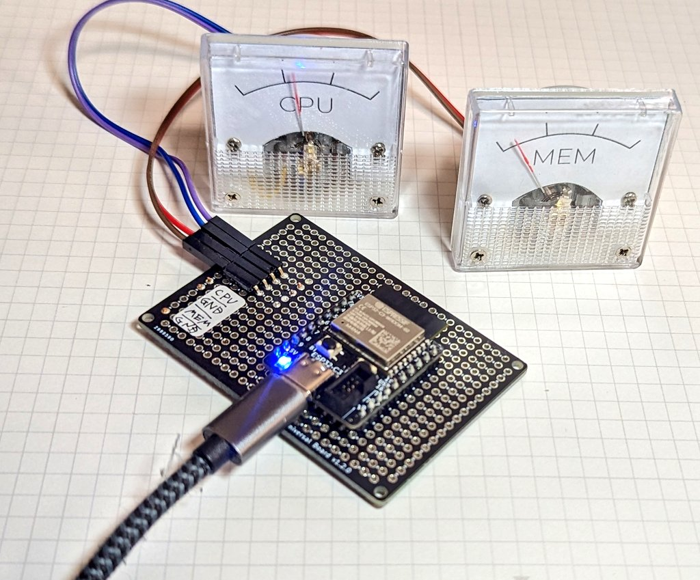

# ESP32-C3 で PC の CPU 使用率を、アナログ電圧計で表示する



[動画ツイート https://twitter.com/74th/status/1801847991126659235/video/2](https://twitter.com/74th/status/1801847991126659235/video/2)

## アーキテクチャ



回路図: [PDF](./semantics/analog-cpu-meter.pdf) [Kicanvas](https://kicanvas.org/?github=https%3A%2F%2Fgithub.com%2F74th%2Fanalog-cpu-meter%2Fblob%2Fmain%2Fsemantics%2Fanalog-cpu-meter.kicad_sch)

## ESP32-C3-Server Firmware

[./esp32-c3-server/](./esp32-c3-server/)

### ビルド＆アップロード

VS Code に拡張機能 PlatformIO をインストールし、esp32-c3-server ディレクトリを開く。

src/ssid.h.sample を src/ssid.h にコピーし、SSID とパスワードを記述する。

コマンド PlatformIO: Upload でビルド＆アップロードする。

事前に、ESP32 の Mac アドレスを調べておき、WiFi ルータにその Mac アドレスに対する固定 IP アドレスを割り当てておくと、IP アドレスが固定されて便利です。

```
$ esptool.py --port /dev/ttyACM0 chip_id
esptool.py v4.5.1
Serial port /dev/ttyACM0
Connecting...
Detecting chip type... ESP32-C3
Chip is ESP32-C3 (revision v0.4)
Features: WiFi, BLE
Crystal is 40MHz
MAC: 40:4c:ca:ee:ad:1c
```

### API

#### POST /cpu

CPU 使用率を設定する。

Request Body:

```
{"value":50}
```

#### POST /mem

メモリ使用率を設定する。

Request Body:

```
{"value":50}
```

#### POST /values

CPU とメモリ使用率を同時に設定する。

Request Body:

```
{"cpu":50,"mem":30}
```

## send-cpu-client

CPU 使用率を送るクライアント。Go 言語で実装。

[./send-cpu-client/](./send-cpu-client/)
